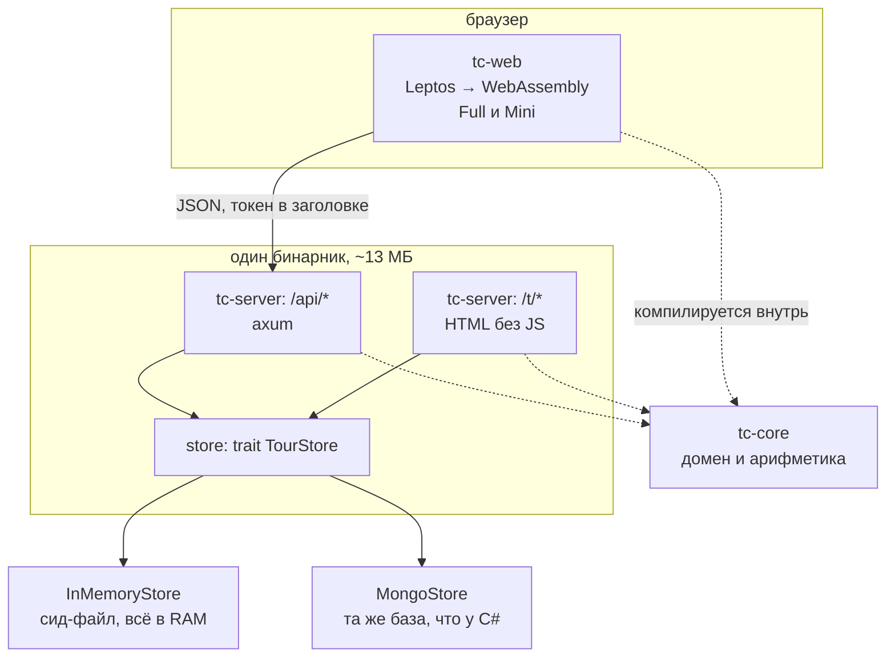
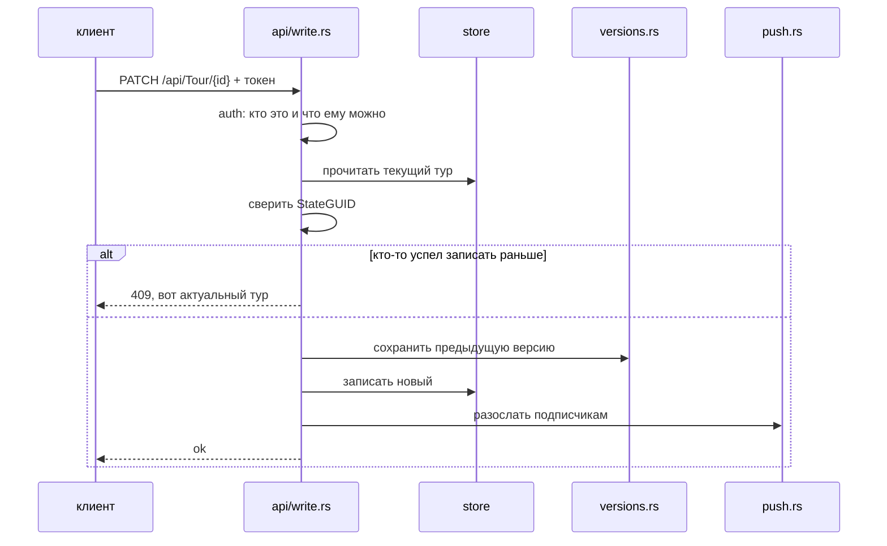
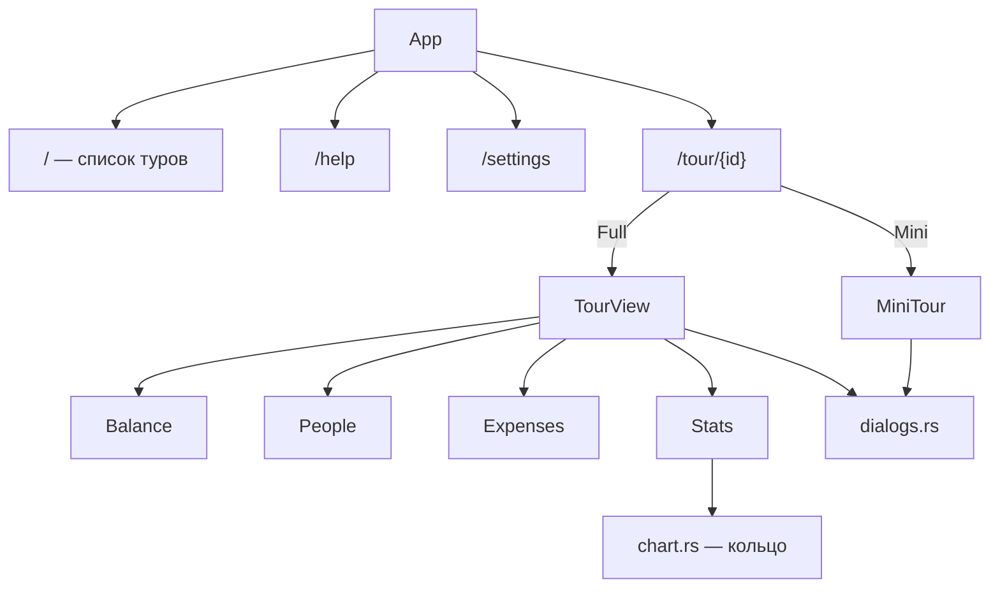
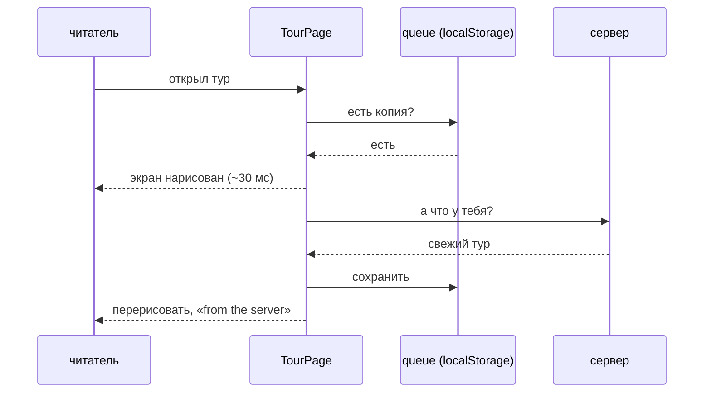
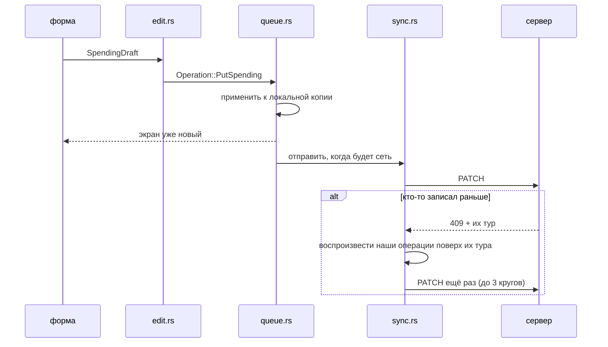
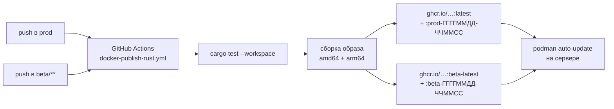

# Tourcalc на Rust — как это устроено и куда лезть

Этот файл для того, кто открыл репозиторий и хочет что-то поменять. Хронология и обоснования
решений — в [`README.md`](README.md) рядом; здесь только устройство, шпаргалка и сценарии
«хочу вот так — иди туда».

- [С чего начать](#с-чего-начать)
- [Из чего это собрано](#из-чего-это-собрано)
- [Как собрать и запустить](#как-собрать-и-запустить)
- [VS Code](#vs-code)
- [Сервер](#сервер)
- [Клиент](#клиент)
- [Две вещи, которые надо понять про клиент](#две-вещи-которые-надо-понять-про-клиент)
- [Шпаргалка по Rust на этом коде](#шпаргалка-по-rust-на-этом-коде)
- [Сценарии: хочу изменить — надо сделать](#сценарии-хочу-изменить--надо-сделать)
- [Грабли](#грабли)
- [Деплой](#деплой)
- [Чего в порте нет](#чего-в-порте-нет)

---

## С чего начать

```bash
./rust/setup.sh            # один раз: toolchain, wasm-таргет, trunk
./rust/build-and-run.sh    # собрать всё и поднять на http://localhost:5401
cd rust && cargo test --workspace
```

Скрипт запуска печатает share-ссылки, которые логинят и открывают тур — тыкать можно сразу,
код доступа вводить не надо.

Три файла, которые стоит прочитать раньше остальных, именно в этом порядке:

| файл | о чём |
|---|---|
| `crates/tc-core/src/domain.rs` | что такое тур, трата, участник — и как это переживает поездку в C#-совместимый JSON |
| `crates/tc-web/src/tour.rs` | экран тура: вкладки, загрузка, Stats. Половина клиента |
| `crates/tc-server/src/api/mod.rs` | все ручки сервера на одном экране |

---

## Из чего это собрано



**`tc-core`** — домен и деньги. Не знает ни про HTTP, ни про базу, ни про браузер: берёт
данные, возвращает данные. Поэтому он компилируется и в серверный бинарник, и в wasm — одна
реализация арифметики на всех. У него ровно две зависимости, и это принцип, а не совпадение:
**всё, что попадает сюда, попадает в браузер**.

**`tc-server`** — axum. Отдаёт `/api/*` (те же пути и написание, что у C#), серверные
текстовые страницы `/t/*` и статику клиента. Хранилище — за трейтом, реализаций две.

**`tc-web`** — Leptos в режиме CSR (всё рисуется в браузере, сервер отдаёт пустой
`index.html`). Стили — **файлы блазорного клиента без изменений**:
`TCBlazor/Client/wwwroot/css/newui.css` и `mini.css` подключаются прямо из соседнего дерева.

Ещё в воркспейсе лежат `spike-*` — замеры размера трёх фреймворков на нулевой фазе. К делу
отношения не имеют, удалять жалко.

---

## Как собрать и запустить

```bash
./rust/build-and-run.sh              # клиент + сервер + запуск, порт 5401
./rust/build-and-run.sh --fast       # не пересобирать клиент (меняли только сервер)
./rust/build-and-run.sh --blazor     # тот же сервер, но отдаёт C#-клиент
./rust/build-and-run.sh --port 5555
```

`--blazor` — главный инструмент сверки: те же данные, те же ссылки, другой клиент. Почти все
расхождения в этом порте находились так.

Отдельные части, если нужно руками:

```bash
cd rust
cargo run -p tc-server                               # только сервер
cd crates/tc-web && trunk serve                      # только клиент, с автоперезагрузкой
cd crates/tc-web && trunk build --release            # то, что уедет в образ
```

Тесты:

```bash
cd rust
cargo test --workspace                               # всё, кроме базы — секунды
cargo test -p tc-core                                # арифметика и совместимость формата
TC_TEST_MONGO=mongodb://127.0.0.1:27017 \
  cargo test -p tc-server --features mongo --test mongo   # с живой монгой
```

Без `TC_TEST_MONGO` монговские тесты не падают, а тихо ничего не делают — так что зелёный
прогон без базы ничего про базу не доказывает.

Настройки сервера читаются из переменных окружения под теми же именами, что у C#
(`crates/tc-server/src/config.rs`, таблица — в корневом [`Readme.md`](../Readme.md)).
Минимум для локального запуска уже прописан в `build-and-run.sh`.

---

## VS Code

В репозитории лежит `.vscode/` — расширения, настройки, задачи и отладчик. Открываете папку,
соглашаетесь на предложенные расширения, и:

| | |
|---|---|
| `Ctrl+Shift+B` | собрать и запустить (`build-and-run.sh`) |
| `Ctrl+Shift+P` → **Tasks: Run Task** | остальные: тесты, clippy, запуск с блазорным клиентом, тесты с базой |
| `F5` | сервер под отладчиком, с брейкпоинтами |

Важное: папка должна быть открыта **через WSL** (расширение Remote — WSL, статус-бар слева
внизу говорит `WSL: ...`). Иначе rust-analyzer будет работать с виндовой стороны через
`\\wsl$\` и тормозить на ровном месте.

Отладчик ловит только сервер — клиент это wasm в браузере, туда брейкпоинты ставятся в
devtools самого браузера (Chrome показывает исходники на Rust), а быстрее всего
`leptos::logging::log!`.

---

## Сервер

```
crates/tc-server/src/
├── main.rs          выбор хранилища, сборка роутера, запуск
├── lib.rs           то же самое как библиотека — чтобы тесты поднимали роутер без сокета
├── config.rs        все переменные окружения
├── state.rs         AppState: хранилище, подписки, ключи, метки сборки
├── auth.rs          токены: подпись, проверка, код доступа → права
├── store.rs         trait TourStore + InMemoryStore
├── mongo.rs         MongoStore (фича `mongo`) + перевод форматов дат и _id
├── versions.rs      версии тура при каждой записи
├── push.rs          web-push (фича `push`)
├── subscriptions.rs кто подписан на уведомления (в памяти или в монге, рядом с турами)
├── api/
│   ├── mod.rs       все маршруты /api/*
│   ├── auth.rs      /api/Auth/*
│   ├── tour.rs      чтение
│   └── write.rs     запись, блокировка, генерация id
└── text/
    ├── mod.rs       маршруты /t/*
    ├── pages.rs     сами страницы
    ├── render.rs    обёртка страницы
    ├── forms.rs     разбор POST-форм
    └── redirect.rs  отправка lynx/w3m на /t
```

Как проходит запрос на запись:



Три вещи, про которые легко забыть:

- **`StateGUID`** — мягкая блокировка. Клиент присылает тот, что видел; не совпал — 409 и
  свежий тур в ответе, а разруливает клиент (см. `sync.rs`).
- **Версии** пишутся на каждое сохранение, если `TourVersioning=true`, и не попадают в список
  туров.
- **Совместимость формата** — не пожелание, а требование: та же база, что у C#. Всё, чего
  домен не знает, едет в `Extras` и возвращается на место нетронутым.

---

## Клиент

```
crates/tc-web/src/
├── main.rs        роутинг, шапка, перехват ссылок, заголовок вкладки
├── list.rs        список туров, вход, создание
├── tour.rs        экран тура: вкладки, свежесть, Expenses, Stats
├── people.rs      вкладка People
├── chart.rs       кольцевая диаграмма в Stats
├── explain.rs     «почему такая цифра» — разборы за каждым числом
├── dialogs.rs     формы: трата, участник, тур, валюты, версии
├── edit.rs        черновики форм и как они меняют тур
├── queue.rs       операции, ожидающие отправки; localStorage
├── sync.rs        отправка очереди и разрешение конфликтов
├── api.rs         HTTP к серверу
├── mini.rs        вся Mini-версия
├── ui.rs          деньги, инициалы, цвета аватарок, подсветка строк
├── icon.rs        SVG-иконки
├── settings*.rs   настройки: порог мелочи, акцентный цвет
├── mode.rs        Full / Mini
├── place.rs       где читатель был: тур в шапке, к которому возвращаются из Help
├── push.rs        подписка на уведомления; колокольчики в списке туров (один POST /api/Subscription/mine на весь список, кэш __tcw_bells)
├── version.rs     страница сборки: какая версия у меня и какая на сервере
└── install.rs     установка приложения на устройство (настройка «Install on this device»)
```

Дерево экранов:



Маршруты разбираются руками в `route_of()` (`main.rs`) — их полтора десятка, роутер-библиотека
на это не нужна. Ссылки перехватываются **одним** слушателем на документе: клик по `<a href>`
меняет сигнал, а не перезагружает страницу. Исключение — `/goto/...`, которая обязана грузиться
по-настоящему.

---

## Две вещи, которые надо понять про клиент

### 1. Сначала рисуем то, что есть

Тур, который на этом устройстве уже открывали, рисуется мгновенно из localStorage, а сервер
спрашивается в фоне. Строчка под названием честно говорит, что сейчас на экране.



Ждать ответа перед отрисовкой — это пустой экран на время сети ради цифр, которые почти всегда
уже есть. Так же делает блазорный клиент (`TCDataService.LoadTourBare`).

### 2. Правка — это записанное намерение, а не отправленный тур



Очередь хранит **намерения** («вес этого человека теперь 50»), а не результат («вот весь
тур»), потому что намерение можно воспроизвести на туре, который успел уехать вперёд. Отсюда
и офлайн: правка в стране без интернета просто лежит в очереди.

Тур на экране — это всегда `последний известный с сервера + очередь`
([`queue::with_pending`](crates/tc-web/src/queue.rs)), и применяется очередь **ровно в одном
месте**. Применить её второй раз — это правка, появившаяся на экране дважды; так уже было.

---

## Шпаргалка по Rust на этом коде

Только то, что реально встретится в этих файлах.

| Конструкция | Что значит здесь |
|---|---|
| `Option<T>` | «может не быть». `.map()`, `.unwrap_or_default()`, `if let Some(x) = ...` |
| `Result<T, E>` | «может не получиться». `?` в конце выражения — «вернуть ошибку выше» |
| `&Tour` / `Tour` | ссылка против владения. Расчёты берут `&Tour` и ничего не копируют |
| `.clone()` | явная копия. В `view!` их много, и это нормально: замыканию нужна своя |
| `impl Trait` | «что-то, что умеет вот это» — например `-> impl IntoView` |
| `Box<dyn TourStore>` | хранилище выбирается при старте, поэтому за указателем |
| `#[cfg(feature = "mongo")]` | кода нет в сборке без фичи |
| `#[serde(rename = "Id")]` | как поле называется в JSON-формате C# |

Про Leptos — четыре вещи, и больше почти ничего:

```rust
let tab = RwSignal::new(Tab::Balance);   // состояние. Copy — можно раздавать в замыкания
tab.get();  tab.set(Tab::People);        // прочитать / записать
let title = Memo::new(move |_| ...);     // производное значение, тоже Copy
Effect::new(move |_| { ... });           // побочное действие, когда сигналы изменились
view! { <div class:is-on=move || tab.get() == Tab::People>...</div> }
```

Правило, из-за которого здесь ломается больше всего сборок: **сигнал `Copy`, а `String` и
`Tour` — нет**. Каждому замыканию нужна своя копия:

```rust
let name = tour.name.clone();
let for_button = name.clone();           // да, ещё одна
view! { <button on:click=move |_| set_title(for_button.clone())>{name}</button> }
```

Полезные команды:

```bash
cargo check -p tc-web        # быстрее сборки, ошибки те же
cargo clippy --workspace --all-targets
cargo fmt
cargo test -p tc-core -- --nocapture       # с печатью
cargo test the_ring_fits                   # один тест по куску имени
```

Сообщения компилятора читать целиком: в них почти всегда лежит готовая правка.

---

## Сценарии: хочу изменить — надо сделать

### Поменять текст, вёрстку или цвет строки в списке трат

`crates/tc-web/src/tour.rs`, компонент `ExpenseRow`. Классы `tcn-*` — блазорные,
`TCBlazor/Client/wwwroot/css/newui.css` **не трогать**: он общий с C#-клиентом. Своё CSS —
в `<style>` внутри `crates/tc-web/index.html`, с префиксом `tcw-`.

Пример из жизни: плашка «payback» — класс `tcw-payback` в `index.html`, а вешается он в
`ExpenseRow`.

### Добавить поле в трату

1. `crates/tc-core/src/domain.rs` — поле в `Spending` и в `wire::Spending`, с
   `#[serde(rename = "…")]` под именем из C#. Если поле не нужно домену — не добавлять вовсе:
   оно и так доедет в `Extras` и вернётся на место.
2. `crates/tc-web/src/edit.rs` — в `SpendingDraft` и в `put_spending`.
3. `crates/tc-web/src/dialogs.rs` — поле формы.
4. `crates/tc-core/tests/golden.rs` — тест, что оно переживает круг JSON → домен → JSON.

### Поменять арифметику

`crates/tc-core/src/calc.rs` и тесты рядом. Здесь же — единственное место, где считается, кто
кому должен, и оно общее для сервера, браузера и текстовых страниц. Любая правка тут сверяется
с C# (`TCalcCore`) — на то и `tests/golden.rs`.

### Добавить вкладку или экран

- Вкладка внутри тура: `enum Tab` и `TourView` в `tour.rs` — кнопка через `TabButton`, тело
  через `<Show when=...>`.
- Отдельный экран: `enum Route` и `route_of()` в `main.rs`, плюс модуль с компонентом.
  Ссылку писать обычным `<a href>` — перехватчик сделает из неё переход без перезагрузки.
- И решить, место это или нет. «Место» — то, куда возвращаются: список и тур. Help и
  Settings — не места: туда заходят посмотреть и выходят обратно. Экран-место добавляет
  себе строчку в `Effect` рядом с `place::went_to_*` в `main.rs` (и, если он про что-то
  именованное, вариант в `enum Place`); экран-не-место не трогает ничего — шапка сама
  превратится в «‹ назад туда, откуда пришли».

### Добавить ручку в API

`crates/tc-server/src/api/mod.rs` — строчка в `routes()`, обработчик в `tour.rs` или
`write.rs`. Тест — в `crates/tc-server/tests/api.rs`: они поднимают роутер прямо в процессе,
без сокета, поэтому быстрые. Если ручку будет звать C#-клиент, путь и написание должны
совпадать с его ожиданиями буква в букву.

### Добавить настройку

`crates/tc-server/src/config.rs` — поле и чтение из `var("…")` под тем же именем, что в C#.
Дальше в `state.rs`, если её должны видеть обработчики. Плюс строчка в таблице корневого
`Readme.md`.

### Поменять что-то в текстовом интерфейсе (`/t`)

`crates/tc-server/src/text/pages.rs` — там HTML строками, намеренно: никакого JS, никакого
шаблонизатора. Маршруты в `text/mod.rs`, тесты в `tests/text.rs` (они ходят по ссылкам и
постят формы, как lynx).

### Добавить иконку

`crates/tc-web/src/icon.rs` — `<Icon name="…"/>`, внутри `match` с путями SVG.

### Поменять иконку приложения

Источников два и оба в `crates/tc-web/`: `favicon.svg` (плитка со своими скруглениями —
вкладка, закладка, `.ico`) и `icon-maskable.svg` (то же самое во весь квадрат — лаунчер сам
обрежет как захочет, кружком или squircle-ом, поэтому всё важное должно лежать внутри
центральных 80%). Остальные восемь файлов — производные:

```bash
cd rust/crates/tc-web
python3 render-icons.py .        # иконки приложения
python3 render-icons.py beta     # иконки беты
```

Бета — это те же восемь файлов под теми же именами в `beta/`, нарисованные из своей пары
SVG (прод-плитка плюс белая **b** в синем углу). Никто на них не ссылается: `beta/` целиком
уезжает в `dist`, а сервер, если `BUILD_TYPE` начинается на `beta`, подставляет этот
каталог перед обычным (`wears_the_beta_skin` в `tc-server/src/lib.rs`, развилка в `main.rs`).
Адреса не меняются, манифест один на оба — значит и установленное на телефон приложение
получает бета-иконку само.

Посмотреть локально: `BUILD_TYPE=beta ./rust/build-and-run.sh`.

### Что-то не сходится с блазорным клиентом

1. Поднять оба на одних данных: `./rust/build-and-run.sh` и он же с `--blazor` на другом порту.
2. Сравнить экраны, а не предположения. Половина расхождений в этом порте была там, где
   «должно совпадать».
3. Найти место в C#: `TCBlazor/Client/Components/NewUI/*.razor` — Full, `MiniUI/*` — Mini.
4. Правку сопроводить тестом, если её можно выразить числом или порядком.

### Изменить порядок списка трат

`crates/tc-web/src/tour.rs`, функции `order_rows` и `categories_in_order` — их же использует
Mini. Правило C#: устойчивая сортировка, а не «отсортировать и развернуть»; у одинаковых
штампов сохраняется порядок хранения.

### Добавить операцию, которая переживает офлайн

`crates/tc-web/src/queue.rs` — вариант в `enum Operation` и его применение в `apply()`. Всё
остальное (очередь, повтор, разрешение конфликта) работает само. Тесты очереди — там же внизу.

---

## Грабли

**`view!` и `>` в атрибуте.** Незакрытое в скобки замыкание с `>` внутри макрос читает как
конец тега:

```rust
class:is-on=move || count.get() > 0        // сломается загадочно
class:is-on=move || { count.get() > 0 }    // так правильно
```

**Ошибка не там, где написано.** Внутри `view!` компилятор часто показывает на начало макроса.
Смотреть надо на последнее, что менялось; `cargo check` — источник истины, а не подчёркивания
в редакторе.

**Стили Mini включаются двумя классами.** `mini.css` написан не только про свои `.tcm-*`:
десяток правил — это `.tcm-shell …` (шапка в 28px, `.tcn-main` во всю ширину) и `body.tcm-on …`
(зажатые формы, которые Mini не рисует сам, а занимает у полного интерфейса). Оба класса
вешаются в `mode::on_the_body` и на `.tcn-shell` в `main.rs`. Без них Mini выглядит почти
правильно — и полгода выглядел, — но с шапкой и диалогами от полного интерфейса.

**Браузер держит старый wasm.** Имя файла клиента содержит хэш, но `index.html` и service
worker кэшируются. Что реально загружено, видно на странице **/help** внизу (`AboutBuild` в
`version.rs`) — там же кнопка обновления и сверка с тем, что отдаёт сервер.

**Пустая страница — это «приложение не стартовало».** В `<body>` живёт только скрипт:
до того как wasm загрузится и Leptos смонтируется, показывать нечего. Поэтому любая
неудача при старте выглядела как белый экран без единого слова — а на телефоне она
случается регулярно: браузер выбрасывает фоновую вкладку, возвращается к ней и просит
мегабайт wasm у радиомодуля, который ещё спит. Теперь в `index.html` есть свой
загрузочный экран, который приложение убирает само (`tcw_started` в `main.rs`), через
девять секунд он превращается в «не запустилось» с кнопкой, а возврат во вкладку, где
приложение так и не поднялось, перезагружает её — не чаще раза в минуту, чтобы не
зациклиться.

**Страница на чужом устройстве — не та страница, которую отдал сервер.** Приложение не
предлагалось к установке на телефоне читателя; сервер при этом отвечал правильно на все
вопросы Chrome, и вердикт самого Chrome по живому сайту был `installabilityErrors: []`.
Оказалось, что на устройстве кто-то (блокировщик, фильтрующий VPN, «щит») **вырезал
`<link rel="manifest">`** из документа — браузеру просто нечего было читать. Отсюда два
вывода. Первый: `index.html` теперь ставит этот тег обратно, если его нет (см. скрипт в
начале `<body>`). Второй, общий: когда что-то «не работает только у него», спрашивать надо
не сервер, а ту самую страницу — настройка «Install on this device» печатает строку
`Checked here — …` ровно для этого, и она же за один заход отличила «старая копия
в браузере» от «правят по дороге».

**Тест DOM отвечает ровно на заданный вопрос.** «Атрибут проставлен» и «строка покрасилась» —
разные вопросы; в этом порте несколько раз первое было правдой, а второе нет. Для видимого —
скриншот.

**Монговские тесты без монги зелёные.** См. выше.

**Размер клиента.** Всё, что добавляется в `tc-core` или `tc-web`, уезжает в браузер.
`trunk build --release` печатает размер — на него стоит смотреть.

---

## Деплой



- Ветка `prod` собирает **растовый** образ и публикует его как `latest` — просто `latest`,
  без упоминания языка: сервер следит за этим именем навсегда, а чем оно внутри сделано,
  видно на странице сборки и в заголовке `X-Tourcalc-Version`.
- Ветки `beta/**` — тот же образ, теги `beta-latest` / `beta-ГГГГММДД-ЧЧММСС`. Бета-хост уже
  следит за `beta-latest`, так что на сервере менять ничего не надо: временные штуки просто
  начинают приезжать туда.
- Ветки `experiments/**` — тег `experiments-rust`, отдельный рабочий контур.
- `BUILD_TYPE` (`betaR (ветка)` / `prodR (prod)`) едет в образ аргументом сборки и живёт
  там переменной окружения. Кроме страницы сборки он решает ещё одно: бета-образ отдаёт
  иконки с буквой **b** — см. «Поменять иконку приложения».
- C#-образы (`blazor-latest`, и он же под `beta-latest`, если запустить руками) с веток
  больше не собираются — только вручную из вкладки Actions.
- Образ: два слоя поверх distroless, сервер статически слинкован с musl, внутри нет ни libc,
  ни шелла, ни пакетного менеджера. Клиент собирается один раз (wasm одинаков для всех
  архитектур), сервер кросс-компилируется — поэтому QEMU в сборке нет и она занимает минуты,
  а не час.
- Контейнер слушает **8080** и работает не от root.
- Что за версия сейчас крутится — низ страницы `/help` в интерфейсе или
  `GET /api/Info/version`: там дата сборки, коммит, имя wasm-файла и время старта. Этого хватает, чтобы отличить «у меня
  старая вкладка» от «на сервер не приехало».
- После обновления образа остаются безымянные старые. Чистятся `podman image prune -f`;
  удобно повесить на `ExecStartPost` в drop-in к `podman-auto-update.service`.

Что стоит сделать в базе один раз: индекс под список туров —

```
db.Tours.createIndex({ AccessCodeMD5: 1, IsVersion: 1 })
```

Список спрашивает ровно по этим двум полям (и C#-сервер спрашивал так же); без индекса это
скан всей коллекции на каждый заход в список.

Минимальный `tourcalc.env` для настоящего прода:

```
MasterKey=…
AuthPrivateECDSAKey=…            # openssl rand -base64 32
StorageType=MongoDb
MongoDbUrl=…
MongoDbUsername=…
MongoDbPassword=…
PushNotificationPublicKey=…      # если нужны уведомления
PushNotificationPrivateKey=…
PushNotificationMailto=mailto:…
```

Ключ подписи токенов **обязательно свой**: дефолтный лежит в репозитории и известен всем.

---

## Чего в порте нет

| | |
|---|---|
| Телеграм-бот | не переносился; живёт только в C#-сборке |
| Classic UI | то же самое |
| Черновики (`IsDryRun`) | данные сохраняются и считаются как раньше, но создать новый черновик в интерфейсе нельзя |
| `AnonymousIsMaster`, `ReturnVersionsInAllTours`, `DoRedirectToDomain`, `DoWakeup`/`WakeupUrl` | не читаются |
| Просмотр логов | как и в C#, ручка есть и всегда пустая |
